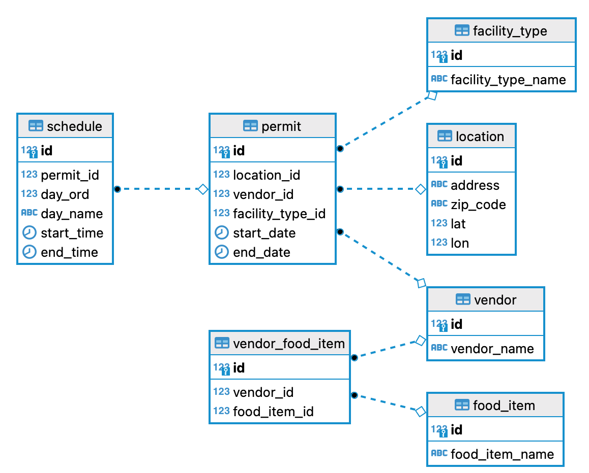

# Food Truck Search API

This project defines a search API for finding food trucks in the City of San Francisco. 

# API

The API currently has a single endpoint:
 
`/food-trucks/search`

It returns a formatted list of food truck vendors, locations with scheduled times, and food menu items

The seach functionality currently supports searching by food item name and vendor

The output is formatted JSON

```json
[
    {
    "name": "Tacos El Primo",
    "permits": [
      {
        "facilityTypeName": "Truck",
        "location": {
          "address": "345 WILLIAMS AVE",
          "zipcode": "58",
          "lat": 37.72980548057414,
          "lon": -122.39924710472444
        },
        "schedule": [
          {
            "dayName": "Su",
            "startTime": "08:00:00",
            "endTime": "22:00:00"
          },
          {
            "dayName": "Mo",
            "startTime": "16:00:00",
            "endTime": "22:00:00"
          },
          {
            "dayName": "Tu",
            "startTime": "16:00:00",
            "endTime": "22:00:00"
          },
          {
            "dayName": "We",
            "startTime": "16:00:00",
            "endTime": "22:00:00"
          },
          {
            "dayName": "Th",
            "startTime": "16:00:00",
            "endTime": "22:00:00"
          },
          {
            "dayName": "Fr",
            "startTime": "16:00:00",
            "endTime": "22:00:00"
          }
        ]
      }
    ],
    "foodItems": [
      {
        "name": "Fruit Juice"
      },
      {
        "name": "Rice Pudding"
      },
      {
        "name": "Flan"
      },
      {
        "name": "Tea"
      },
      {
        "name": "Chile Relleno Plate"
      },
      {
        "name": "Tacos"
      },
      {
        "name": "Vegetable Juice"
      },
      {
        "name": "Various Meat And Chicken And Fish Plate"
      },
      {
        "name": "Coffee"
      },
      {
        "name": "Burritos"
      },
      {
        "name": "Fish Plate"
      },
      {
        "name": "Tortas"
      },
      {
        "name": "Bread"
      },
      {
        "name": "Mexican Food"
      }
    ]
  }
]
```

# Running the project

## Requirements

- Docker

## Starting
All components are defined in docker-compose.yml. 
In order to run the project:

- Build the project using `docker-compose build`
- Start the project using `docker-compose up`

This will start the service at `localhost` and listen on port `3000`

## Sample Queries

### Search by Food Item

```bash
curl -X GET \
  -H "Content-type: application/json" \
  -H "Accept: application/json" \
  -d '{"foodItems":["Coffee"]}' \
  http://localhost:3000/food-truck/search
```
### Search by Vendor Name

```bash
curl -X GET \
  -H "Content-type: application/json" \
  -H "Accept: application/json" \
  -d '{"vendorName":"Tacos El Primo"}' \
  http://localhost:3000/food-truck/search
```

# Technical Description

## Components

This project consists of 2 components - A storage solution implemented in Postgres and an API solution using Node.js, Typescript, and Express

## Storage

The storage solution is based on using Liquibase to create a schema and populate it with data

It follow the process of
 - Creating a schema for holding the raw CSV import and the destination schema, which is a normalized relational schema.
 - Loading a CSV dump of food truck permit records to the raw staging table
 - Transforming and inserting the raw data into the normalized schema

 ### Storage Schema



## Food Truck Service

The food truck service defines an API to return food truck search results for the food truck entities defined above. 

It is defined using an orthagonal architecture broken into the following modules:

### Domain
The domain module defines all entities used throughout the application including
 - Models
 - Use Case Contracts
 - Repository Contracts
 - Data Transfer Objects

 ### Infrastructure
 The infrastructure module defines the infrastructure and processes necessary for the application to interact with the backing data store.

It includes:
    - Database specific entity classes
    - Database connection instantiation
    - Repositories implementing specific queries
    - Mappers to map a database result set to a model class
    - Use cases to instantiate particular repository queries

The data access layer is implemented using the Kysely library, which is a lightweight query builder intended to make transparent and typesafe queries for Typescript.

### Presentation
The presentation module consists of components that handle the interaction between the application and the outside world. In this case the presentation layer consists of entirely of controllers that map an API invocation to the requested use case.

### Main
The main component consists of any necessary component for instantiating and running the Express API server this includes.

- Server configuration and instantiation
- Factories to instantiate controllers and inject dependencies
- Routes for specific modules